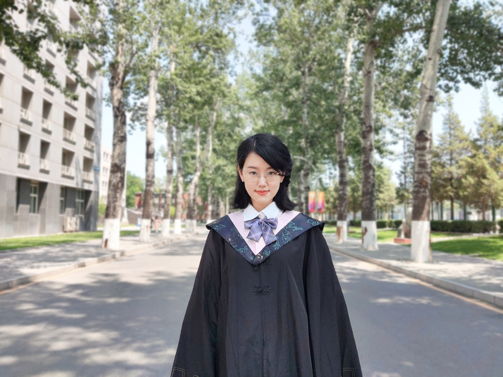

# About Me

Here is **Tianrui Wang (Aurora, 王天睿)**.

I am a master’s student majoring in history of science and technology at the **University of Chinese Academy of Sciences**. My research interests mainly include history of science and technology, educational technology, foreign languages and literature, natural language processing and deep learning, etc.

Here is [my Resume(Chinese Version)](Resume-TianruiWang.pdf).

